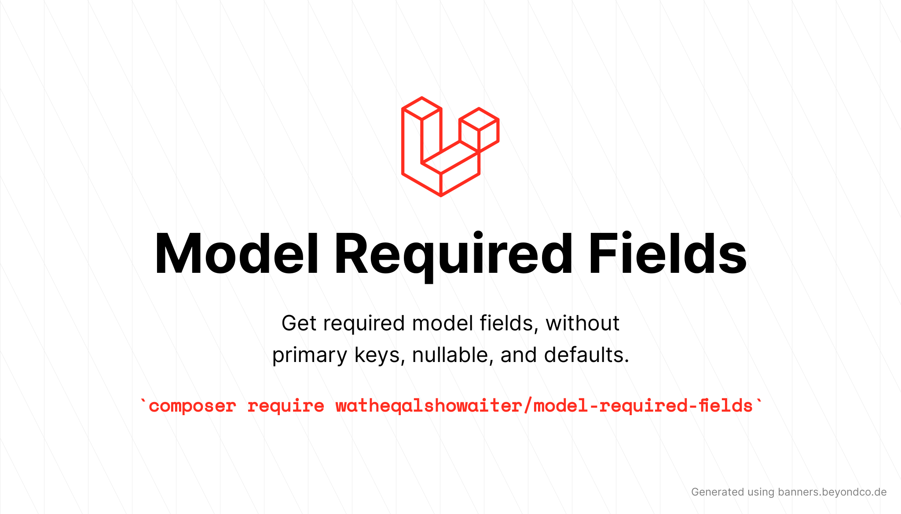

# Model Required Fields

[](https://packagist.org/packages/watheqalshowaiter/model-required-fields)
[](https://github.com/watheqalshowaiter/model-required-fields/actions?query=workflow%3Arun-tests+branch%3Amain)
[](https://github.com/watheqalshowaiter/model-required-fields/actions?query=workflow%3A"Fix+PHP+code+style+issues"+branch%3Amain)
[](https://packagist.org/packages/watheqalshowaiter/model-required-fields)

Get the **required** model fields, excluding **primary keys**, **nullable** fields, and fields with **defaults**.

## Installation

You can install the package via Composer:

```bash
composer require watheqalshowaiter/model-required-fields
```

## Usage

We Assume that the `User` model has this schema as the defaults

```php
Schema::create('users', function (Blueprint $table) {
    $table->id(); // primary key
    $table->string('name'); // required
    $table->string('email')->unique(); // required
    $table->timestamp('email_verified_at')->nullable(); // nullable
    $table->string('password'); // required
    $table->rememberToken(); // nullable
    $table->timestamps(); // nullable
});
```

- Add the `RequiredFields` trait to your model

```php
use WatheqAlshowaiter\ModelRequiredFields\RequiredFields;

class User extends Model
{
   use RequiredFields;
}
```

- Now use the trait as follows

```php
User::requiredFields(); // returns ['name', 'email', 'password']
```

That's it!

### Another Complex Table

let's say the `Post` model has these fields

```php
Schema::create('posts', function (Blueprint $table) {
    $table->uuid('id')->primary(); // primary key
    $table->foreignId('user_id')->constrained(); // required
    $table->foreignId('category')->nullable(); // nullable
    $table->uuid(); // required (but will be changed later) 👇
    $table->ulid()->nullable(); // nullable (but will be changed later) 👇
    $table->boolean('active')->default(false); // default
    $table->string('title'); // required
    $table->json('description')->nullable(); // nullable (but will be changed later) 👇
    $table->string('slug')->nullable()->unique(); // nullable
    $table->timestamps(); // nullable
    $table->softDeletes(); // nullable
});

// later migration..
Schema::table('posts', function(Blueprint $table){
    $table->json('description')->change(); // required
    $table->ulid()->change(); // required
    $table->uuid()->nullable()->change(); // nullable
});
```

- We can add the `RequiredFields` trait to the `Post` Model

```php
use WatheqAlshowaiter\ModelRequiredFields\RequiredFields;

class Post extends Model
{
   use RequiredFields;
}
```

- Now use the trait as follows

```php
Post::requiredFields(); // returns ['user_id', 'ulid', 'title', 'description']
```

## Why?

### The problem
I wanted to add tests to a legacy project that didn't have any. I wanted to add tests but couldn't find a factory, so I tried building them. However, it was hard to figure out the required fields for testing the basic functionality since some tables have too many fields.

### The Solution
To solve this, I created a simple trait that retrieves the required fields easily. Later, I added support for older Laravel versions, as that was where most of the use cases occurred. Eventually, I extracted it into this package.

So Briefly, This package is useful if:

- you want to build factories or tests for projects you didn't start from scratch.
- you are working with a legacy project and don't want to be faced with SQL errors when creating tables.
- you have so many fields in your table and want to get the required fields fast.
- or any use case you find it useful.

## Testing

```bash
composer test
```

## Changelog

Please see [CHANGELOG](CHANGELOG.md) for more information on what has changed recently.

## Contributing

If you have any ideas or suggestions to improve it or fix bugs, your contribution is welcome. I encourage you to look at [todos](./todos.md) which are the most important features need to be added. If you have something different, submit an issue first to discus or report a bug, then do a pull request.

## Security Vulnerabilities

If you find any security vulnerabilities don't hesitate to contact me at `watheqalshowaiter[at]gmail[dot]com` to fix
them.

## Credits

- [Watheq Alshowaiter](https://github.com/WatheqAlshowaiter)
- [All Contributors](../../contributors)

## License

The MIT License (MIT). Please see [License File](LICENSE.md) for more information.
