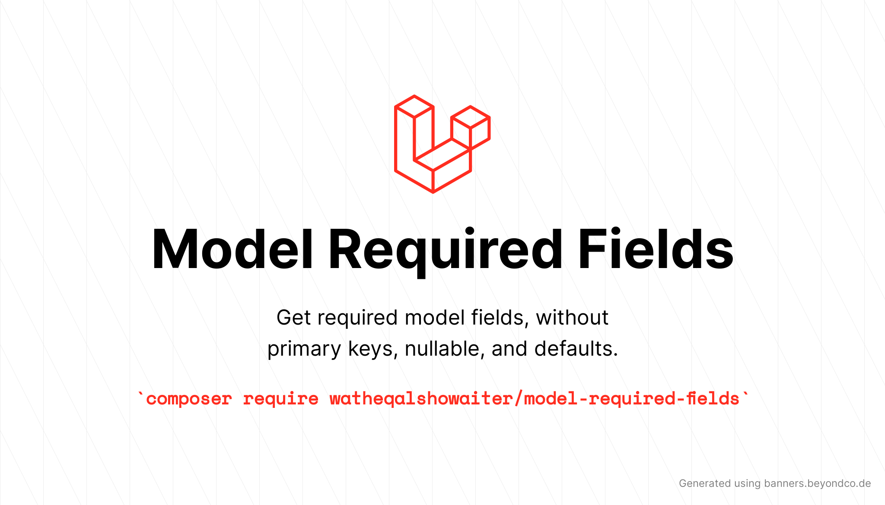

# Model Fields

<!-- shields -->
[![Required Laravel Version][ico-laravel]][link-packagist]
[![Required PHP Version][ico-php]][link-packagist]
[![Latest Version on Packagist][ico-version]][link-packagist]
![GitHub Test Matrix Action Status][ico-test-matrix]
![GitHub Code Style Action Status][ico-code-style]
[![Total Downloads][ico-downloads]][link-downloads]
![GitHub Stars][ico-github-stars]
[![StandWithPalestine][ico-palestine]][link-palestine]
[![ko-fi][ico-ko-fi]][link-ko-fi]

[ico-laravel]: https://img.shields.io/badge/Laravel-6.0%20--%2013.0-ff2d20?style=flat-square&logo=laravel
[ico-php]: https://img.shields.io/packagist/php-v/watheqalshowaiter/model-fields?color=%238892BF&style=flat-square&logo=php
[ico-version]: https://img.shields.io/packagist/v/watheqalshowaiter/model-fields.svg?style=flat-square
[ico-downloads]: https://img.shields.io/packagist/dt/watheqalshowaiter/model-fields.svg?style=flat-square&color=%23007ec6
[ico-code-style]: https://img.shields.io/github/actions/workflow/status/watheqalshowaiter/model-fields/fix-php-code-style-issues.yml?branch=main&label=code%20style&style=flat-square
[ico-test-matrix]: https://img.shields.io/github/actions/workflow/status/watheqalshowaiter/model-fields/test-matrix.yml?branch=main&label=tests&style=flat-square
[ico-github-stars]: https://img.shields.io/github/stars/watheqalshowaiter/model-fields?style=flat-square
[ico-palestine]: https://raw.githubusercontent.com/TheBSD/StandWithPalestine/main/badges/StandWithPalestine.svg
[ico-ko-fi]: https://img.shields.io/badge/Ko--fi-Support-ff5f5f?logo=ko-fi&style=flat-square

[link-packagist]: https://packagist.org/packages/watheqalshowaiter/model-fields
[link-downloads]: https://packagist.org/packages/watheqalshowaiter/model-fields/stats
[link-palestine]: https://github.com/TheBSD/StandWithPalestine/blob/main/docs/README.md
[link-ko-fi]: https://ko-fi.com/watheq_show
<!-- ./shields -->

Quickly retrieve **required**, **nullable**, and **default** fields for any Laravel model. Think that's simple? You
probably haven’t faced the legacy projects I have. :).

> [!Note]  
> This is the documentation for version 3, if you want the version 1 or version 2 documentations go  
> V2 with [this link](./v2.documentation.md).\
> V1 with [this link](./v1.documentation.md).

## Installation

You can install the package via Composer:

```sh
composer require watheqalshowaiter/model-fields --dev
```

We prefer `--dev` because you usually use it in development, not in production. If you have a use case that requires
using the package in production, then remove the --dev flag.

Optionally, if you want to publish the configuration to disable/enable model macros.

```sh
php artisan vendor:publish --provider="WatheqAlshowaiter\ModelFields\ModelFieldsServiceProvider" --tag="config"
```

## Usage

We Assume that the `User` model has this schema as the default.

```php
Schema::create('users', function (Blueprint $table) {
    $table->id(); // primary key
    $table->string('name'); // required
    $table->string('email')->unique(); // required
    $table->timestamp('email_verified_at')->nullable(); // nullable
    $table->string('password'); // required
    $table->string('random_number'); // default (in model attributes)
    $table->rememberToken(); // nullable
    $table->timestamps(); // nullable
});
```

> [!IMPORTANT]  
> We have two ways:
> - Either use the `ModelFields` facade.
> - Or use the method statically on the model. (using the magic of laravel macros).
> - Or use the `model:fields` console command.

Here is the sample:

```php
// Facade way
use WatheqAlshowaiter\ModelFields\Fields;
use App\Models\User;

Fields::model(User::class)->allFields(); // returns ['id', 'name', 'email', 'email_verified_at', 'password', 'random_number', 'remember_token', 'created_at', 'updated_at']
Fields::model(User::class)->requiredFields(); // returns ['name', 'email', 'password']
```

```php
// Macro way
User::allFields(); // returns ['id', 'name', 'email', 'email_verified_at', 'password', 'random_number', 'remember_token', 'created_at', 'updated_at']
User::requiredFields(); // returns ['name', 'email', 'password']
```

```sh 
# console command
php artisan model:fields \\App\\Models\\User --all --format=json
php artisan model:fields "App\Models\User" --required --format=table
```

That's it!

> [!NOTE]
> To disable the macro approach, set the `enable_macro` value to false in the published `model-fields.php`
> configuration file.

### Another Complex Table

Let's say the `Post` model has these fields

```php
Schema::create('posts', function (Blueprint $table) {
    $table->uuid('id')->primary(); // primary key
    $table->foreignId('user_id')->constrained(); // required
    $table->foreignId('category_id')->nullable(); // nullable
    $table->uuid(); // required (but will be changed later) 👇
    $table->ulid('ulid')->nullable(); // nullable (but will be changed later) 👇
    $table->boolean('active')->default(false); // default
    $table->string('title'); // required
    $table->json('description')->nullable(); // nullable (but will be changed later) 👇
    $table->string('slug')->nullable()->unique(); // nullable
    $table->timestamps(); // nullable
    $table->softDeletes(); // nullable
});

// later migration..
Schema::table('posts', function(Blueprint $table){
    $table->json('description')->nullable(false)->change(); // required
    $table->ulid('ulid')->nullable(false)->change(); // required
    $table->uuid()->nullable()->change(); // nullable
});
```

```php
// Facade way 
Fields::model(Post::class)->requiredFields(); // returns ['user_id', 'ulid', 'title', 'description']
// Macro way
Post::requiredFields();  // returns ['user_id', 'ulid', 'title', 'description']
```

```sh
# console command 
php artisan model:fields App\\Models\\Post --required # or -r
```

#### Observer and Event-Filled Fields

Fields that are automatically filled when creating by model observers, boot events, and event listeners are
automatically excluded from required fields.

The package supports three patterns:

- **Boot method closures:** `self::creating()`, `self::saving()`
- **Observer pattern:** `PostObserver` class
- **Dispatched events:** `$dispatchesEvents` property

For example, given this model:

```php
class Post extends Model
{
    protected $dispatchesEvents = [
        // a dispatched event trigger listener that fills the `user_id` field
        'creating' => PostCreatingEvent::class, 
    ];

    protected static function boot()
    {
        parent::boot();
        self::observe(PostObserver::class);

        self::creating(function ($model) {
            $model->ulid = Str::ulid();
        });
        
        self::saving(function ($model) {
            $model->title = 'default title'
        });
    }
}

class PostObserver
{
    public function creating(Post $model): void
    {
        $model->description = 'default description';
    }
    
    public function saving(Post $model): void
    {
        $model->description = 'default saving description';
    }
}
```

```php
Post::requiredFields();

// returns [] because it excludes auto-filled fields 
```

### And more

We have the flexibility to get all fields, required fields, nullable fields, primary key, database default fields,
application default fields, and default fields. You can use these methods with these results:

#### All fields

```php
Fields::model(Post::class)->allFields();

// or
Post::allFields();

// returns
// [    'category_id', 'uuid', 'ulid', 'description',
//      'slug', 'created_at', 'updated_at', 'deleted_at'
// ]
```

```sh
php artisan model:fields App\\Models\\Post --all # or just the model without option because it is the default
```

#### Nullable fields

```php
Fields::model(Post::class)->nullableFields();

//or
Post::nullableFields();

// returns
// [
//     'category_id', 'uuid', 'slug',
//     'created_at', 'updated_at', 'deleted_at'
// ]
```

```sh
# console command
php artisan model:fields App\\Models\\Post --nullable    # or -N
```

#### Primary field

```php
Fields::model(Post::class)->primaryField();

// or
Post::primaryField();

// returns ['id']
```

```sh
# console command
php artisan model:fields User --primary     # or -p
```

#### Database default fields

```php
Fields::model(Post::class)->databaseDefaultFields();

//or 
Post::databaseDefaultFields();

// returns ['active']
```

```sh
# console command
php artisan model:fields User --db-default  # or -D
```

#### Application default fields

```php
Fields::model(Post::class)->applicationDefaultFields();

//or 
Post::applicationDefaultFields();

// If there are default attributes in the model
class Post extends Model
{
    protected $attributes = [
        'title' => 'default title', 
        'description' => null, // will be ignored
    ];
    
     protected $dispatchesEvents = [
        // if there is a field autofilled by this event,
        // then it will be added to the application default fields
        'creating' => PostCreatingEvent::class, 
    ];
    
    // or any event-filled fields
     protected static function boot(): void
    {
        parent::boot();
        self::observe(PostObserver::class);

        self::creating(function ($model) {
            $model->uuid = Str::uuid();
        });

        self::saving(function ($model) {
            $model->ulid = Str::ulid();
        });
    }
}

// the same in the observer class
class PostObserver
{
    
    public function creating(Post $model): void
    {
        // ..
    }
    
    public function saving(Post $model): void
    {
        // ..
    }
}

// returns
// [
//     'title', 'uuid', 'ulid',
// ]
```

```sh
#console command
php artisan model:fields User --app-default # or -A
```

#### Default fields

```php
Fields::model(Post::class)->defaultFields();

//or 
Post::defaultFields();

// This will combine application and database defaults 
class Post extends Model
{
    protected $attributes = [
        'title' => 'default title', 
    ];
    
    protected static function boot(): void
    {
        parent::boot();

        self::creating(function ($model) {
            $model->description = 'default description';
        });
    }
}

// returns
// [
//    'active', 'title', 'description',
// ]
```

```sh
#console command
php artisan model:fields User --default     # or -d
```

### More on console commands

- All fields is the default option if you didn't specify one.

```sh
php artisan model:fields \\App\\Models\\Post # will result all fields
```

- The package will try to find models in common places if you don't provide full namespace.

```sh
php artisan model:fields User # It will try to find the model in `App\Models\User` or `App\User` namespaces
```

- You can add namespaces in two ways: in two backslashes `\\` or inside double quotes `""`. This is a laravel thing and
  not specific to the package.

```sh
php artisan model:fields \\Modules\\Order\\src\\Models\\Order
# or 
php artisan model:fields "Modules\Order\src\Models\Order"
```

- You have 3 output formats: list, json, and table. the list is the default

```sh
php artisan model:fields User --format=json
php artisan model:fields User --format=table
php artisan model:fields User --format=list  # default
```

## Why?

### The problem

I wanted to add tests to a legacy project that didn't have any. I wanted to add tests but couldn't find a factory, so I
tried building them. However, it was hard to figure out the required fields for testing the basic functionality since
some tables have too many fields across many migration files.

### The Solution

To solve this, I first created a simple facade class and a trait (which was later removed) to allow direct method usage
on models for retrieving required fields. Later, I added support for older Laravel versions, as most use cases were on
those versions.

So Briefly, This package is useful if:

- you want to build factories or tests for projects you didn't start from scratch.
- you are working with a legacy project and don't want to be faced with SQL errors when creating tables.
- you have so many fields in your table and want to get types of fields fast, like required, nullable, default fields.
- or any use case you find it useful.

## Features

✅ Supports Laravel versions: 13, 12, 11, 10, 9, 8, 7, and 6.

✅ Supports PHP versions: 8.4, 8.3, 8.2, 8.1, 8.0, and 7.4.

✅ Supports multiple ways of fetching fields: using console commands, or facades, or models macros.

✅ Supports SQL databases: SQLite, MySQL/MariaDB, PostgreSQL, and SQL Server.

✅ Fully automated tested with PHPUnit.

✅ Full GitHub Action CI pipeline to format code and test against all Laravel and PHP versions.

✅ Can return fields based on the dynamically added class strings (in the facade method).

## Testing

```sh
composer test
```

## Changelog

Please see [CHANGELOG](CHANGELOG.md) for more information on what has changed recently.

## Contributing

If you have any ideas or suggestions to improve it or fix bugs, your contribution is welcome.

I encourage you to look at [Issues](https://github.com/WatheqAlshowaiter/model-fields/issues) which are the
most important features that need to be added.

If you have something different, submit an issue first to discuss or report a bug, then do a pull request.

## Security Vulnerabilities

If you find any security vulnerabilities don't hesitate to contact me at `watheqalshowaiter[at]gmail[dot]com` to fix
them.

## Related Packages

- **[Backup Tables](https://github.com/WatheqAlshowaiter/backup-tables)** - Backup single or multiple database tables
  with ease.
- **[Filament Sticky Table Header](https://github.com/WatheqAlshowaiter/filament-sticky-table-header)** - Make Filament
  table headers stick when scrolling for better UX.
- **[Quran Validator for PHP](https://github.com/WatheqAlshowaiter/quran-validator-php)** - Validate and verify Quranic verses in LLM-generated text with high accuracy.


## Support this project

If this project helps you, consider supporting it on [Ko-fi ☕](https://ko-fi.com/watheq_show).

## Credits

- [Watheq Alshowaiter](https://github.com/WatheqAlshowaiter)

- [All Contributors](https://github.com/WatheqAlshowaiter/model-fields/graphs/contributors)

## License

The MIT License (MIT). Please see [License File](LICENSE.md) for more information.
